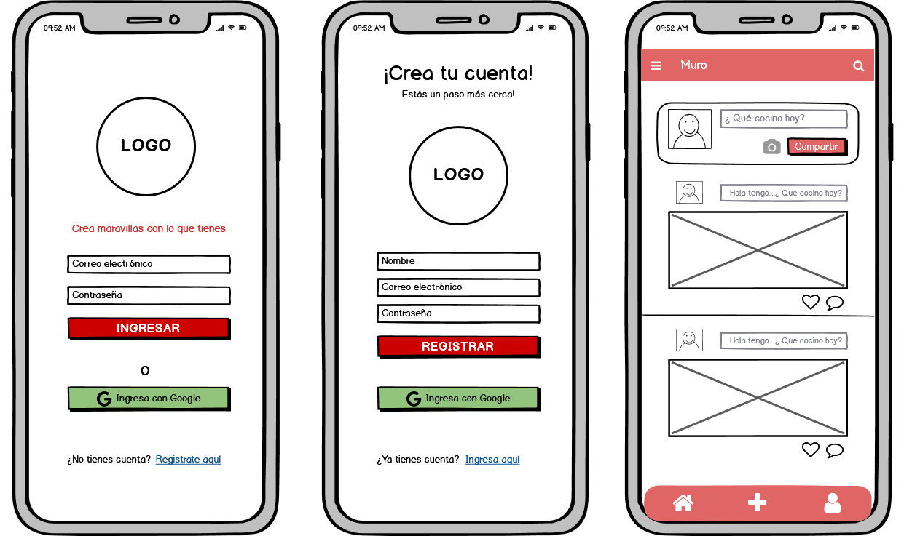
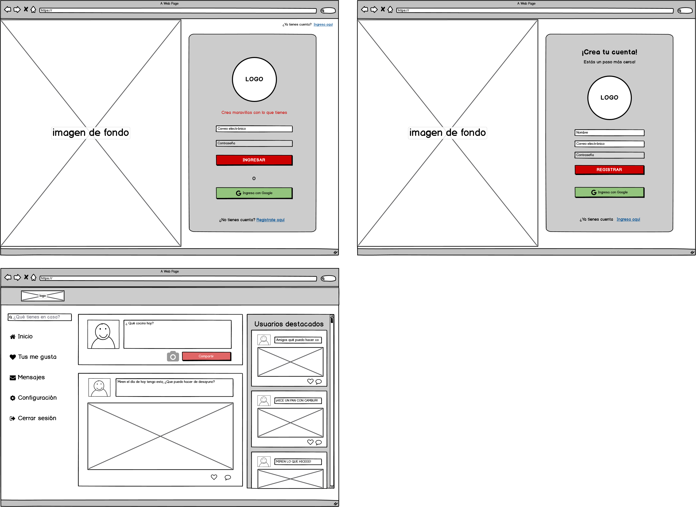

# ¿QUÉ COCINO HOY? 

## Índice

* [1. Red Social ¿Qué cocino hoy?](#1-red-social-¿qué-cocino-hoy?)
* [2. Perfil de Usuario](#2-perfil-de-usuario)
* [3. Historias de usuario](#3-historias-de-usuario)
* [4. Prototipos](#4-prototipos)
* [5. Interfaz](#5-interfaz)


## 1. Red Social ¿Qué cocino hoy?

¿Qué cocino hoy? es una red social diseñada para recibir ayuda de parte de otros usuarios que también han tenido dificultades al momento de escoger que cocinar. La diferencia entre otras aplicaciones de cocina es que los usuarios deben preguntar recetas a partir de lo que tengan disponible en sus casas y no comprando los ingredientes que falten. 

Gracias a la posibilidad de compartir y ayudar a los demás en esta tarea que se torna tan complicada en ocasiones es que esta comunidad podrá crecer de manera favorable. 


## 2. Perfil de usuario

#### -¿Quiénes son los principales usuarios del producto?

Enfocada para cualquier persona que tenga acceso a internet y necesite opciones e ideas para cocinar algo con lo que tenga independiente de la hora que sea. 

#### -¿Cuáles son los objetivos de estos usuarios en relación con el producto?

Los objetivos de nuestros usuarios es poder encontrar una guía a partir de lo que han hecho otras personas que han estado en esta misma situación. 

#### -¿Cuáles son los componentes principales de la interfaz y por qué?

Lo más importante es que las personas puedan compartir post y fotografías de la comida que realizaron. Es importante ver el resultado obtenido para generar confianza y ganas de participar. 


## 3. Historias de usuario

### 1. “Como usuario quiero tener una cuenta en la red social para poder usarla exclusivamente aquí”.

```
CRITERIOS DE ACEPTACIÓN:
- Permitir ingresar un correo electrónico y una contraseña en (input).
- Lo que se escriba en el campo (input) de contraseña debe ser secreto.
- Mostrar error si no se han rellenado los campos. 
- Si deseo crear una cuenta donde puedo ingresar mi nombre/nick para personalizar mi experiencia. 

DEFINICIÓN DE TERMINADO

-
-
-


```

## 4. Prototipos


### Prototipo de baja fidelidad

En dispositivos: 


En desktop: 

### Prototipo de alta fidelidad

En este link podrás encontrar el prototipo de alta fidelidad en Figma.

 <details>
<summary> Clic para ver el link </summary>
https://www.figma.com/file/q312afVAlgQQq7u8cnfdjK/Qu%C3%A9-cocino?node-id=0%3A1

</details>
<br>

### 5. Interfaz


